# MachineLearning

## PCA
pca is a machine learning method to put the high level data like 3D reduce to 2D
remember to transpose before drawing the plot

  
  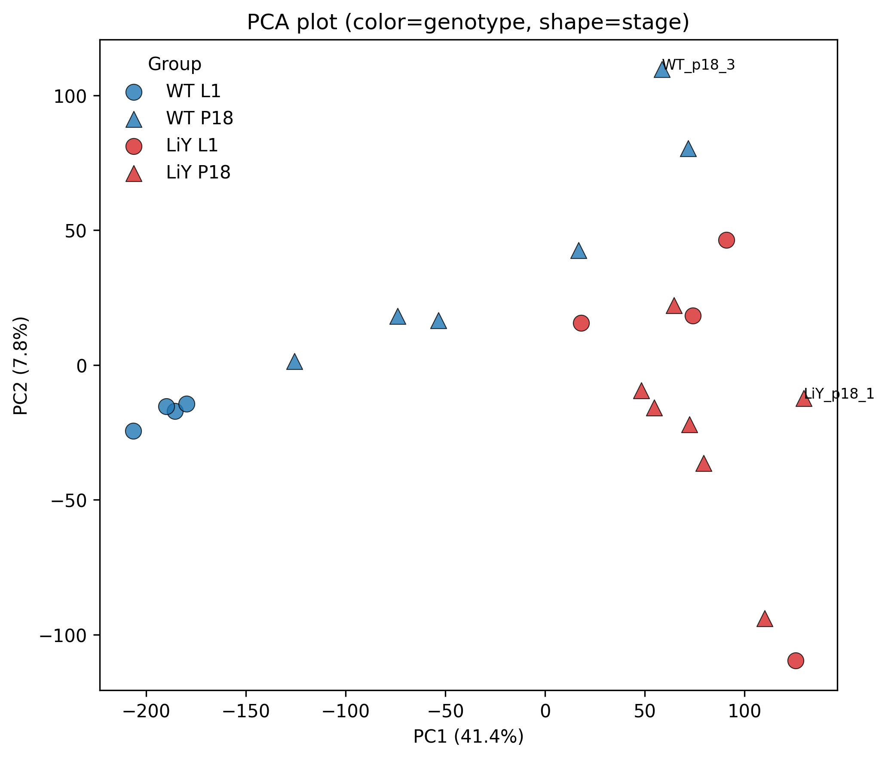

<a href="https://www.notion.so/llsp/homework1-Lin-Liu-2e906d13592280a9adc6dea6ef23f024?source=copy_link" target="_blank">report file</a>

## Kmeans and PCA
Kmeans is for cluster group

  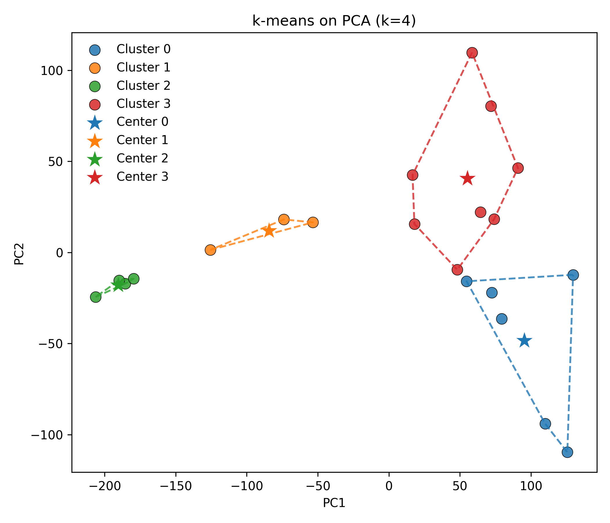
  
  

<a href="https://www.notion.so/llsp/homework2-Kmeans-and-heatmap-2f606d13592280f4afbbfc2e3799e50b?source=copy_link" target="_blank">report file</a>

## Navie bys
Predict result through condition. could be calculate by hand.

## Heatmap

  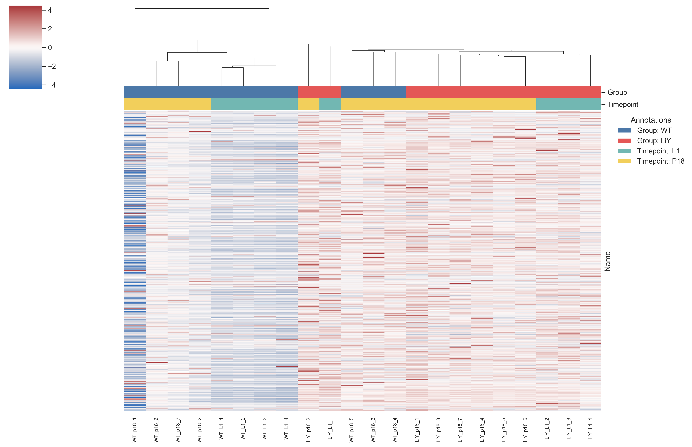
  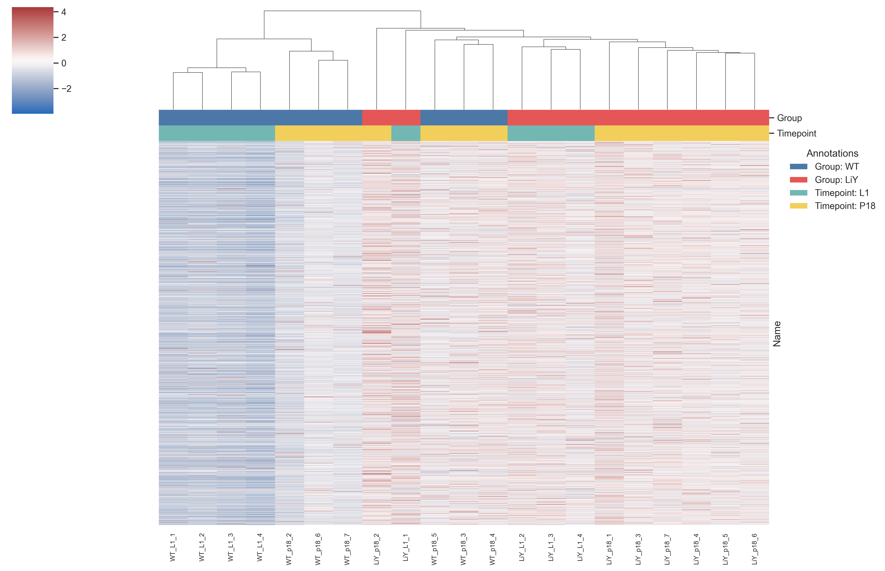

  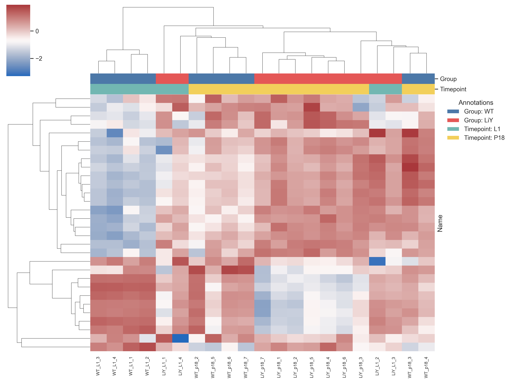
  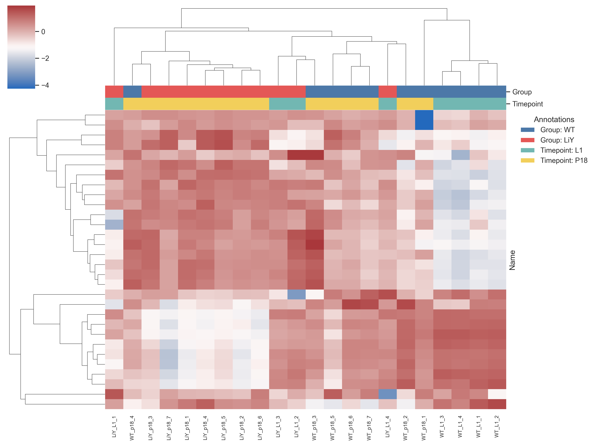

<a href="https://www.notion.so/llsp/homework3-navie-bys-2f706d135922802e953ae9b34f43ada8?source=copy_link" target="_blank">report file</a>

## Decision Tree

  <!-- 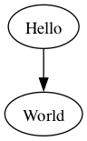 -->
  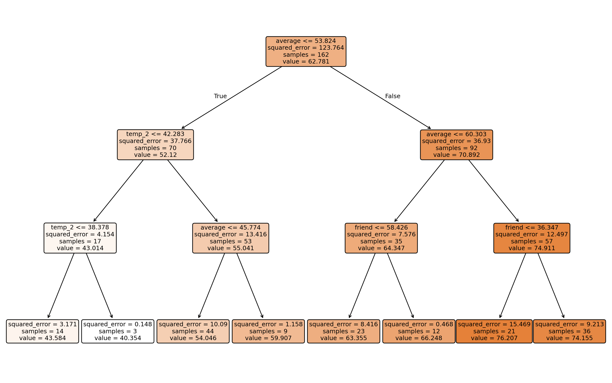

<a href="https://www.notion.so/llsp/homework4_decisionTree-30506d13592280ea85d2fcebc1998a4d?source=copy_link" target="_blank">report file</a>

## Logistic Regression
<a href="https://www.notion.so/llsp/HW05-Logistic-Regression-30b06d1359228087a30bd0c5467409a3?source=copy_link" target="_blank">report file</a>

## Nuralnetwork

  <!--  -->
  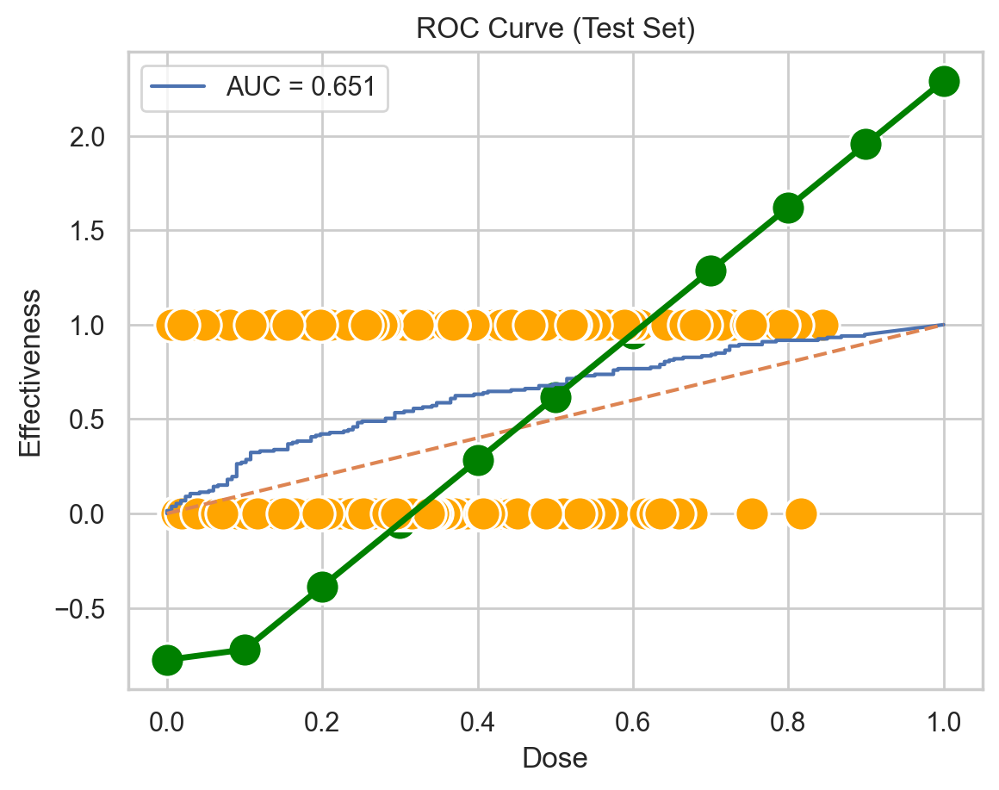
  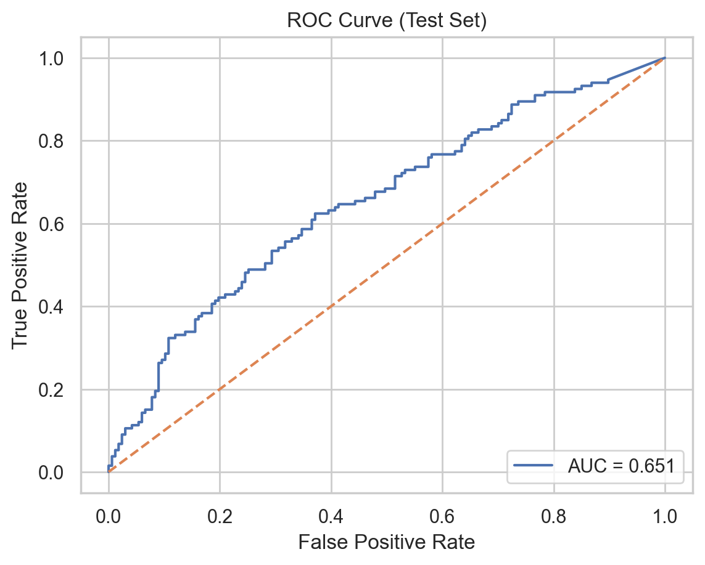

  <!--  -->
  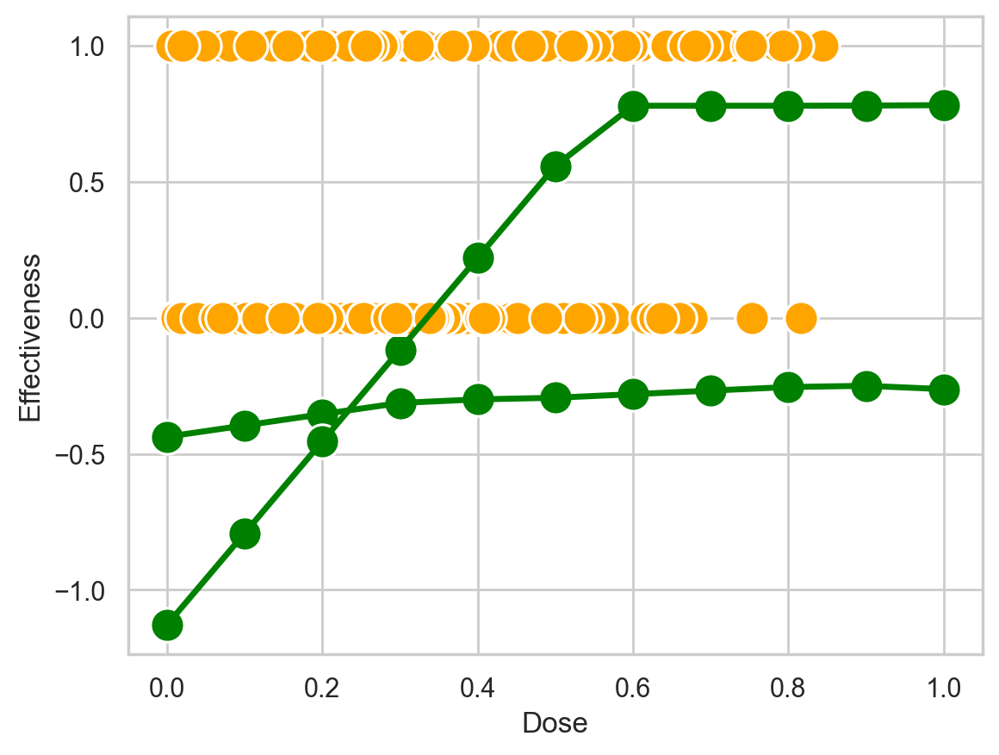
  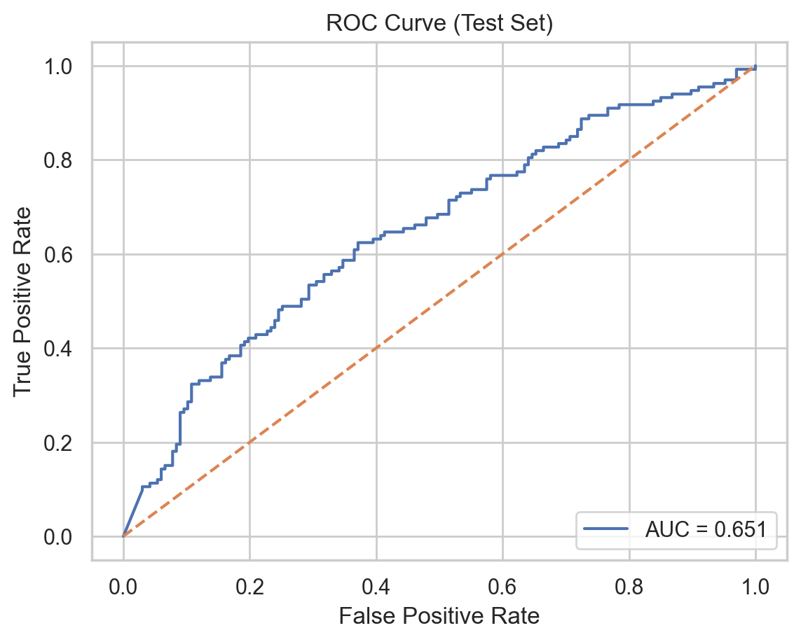

<a href="https://www.notion.so/llsp/HW05-neural-network-part-1-31206d135922805886f1f6683c4377fd?source=copy_link" target="_blank">report file</a>

## multiple input nural network

  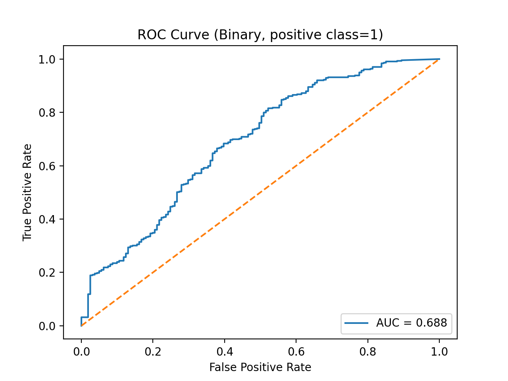

<a href="https://www.notion.so/llsp/HW06-neural-network-part-2-32006d13592280d6af40fb481d9e95fd?source=copy_link" target="_blank">report file</a>
