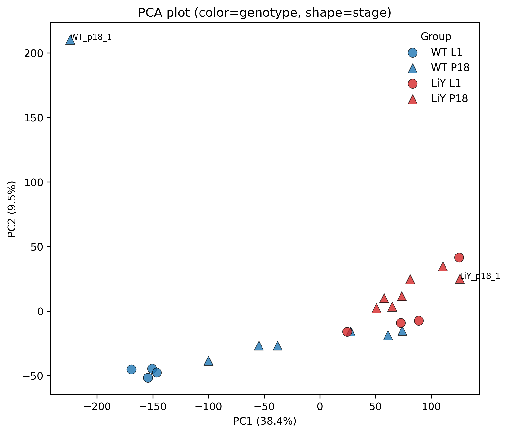
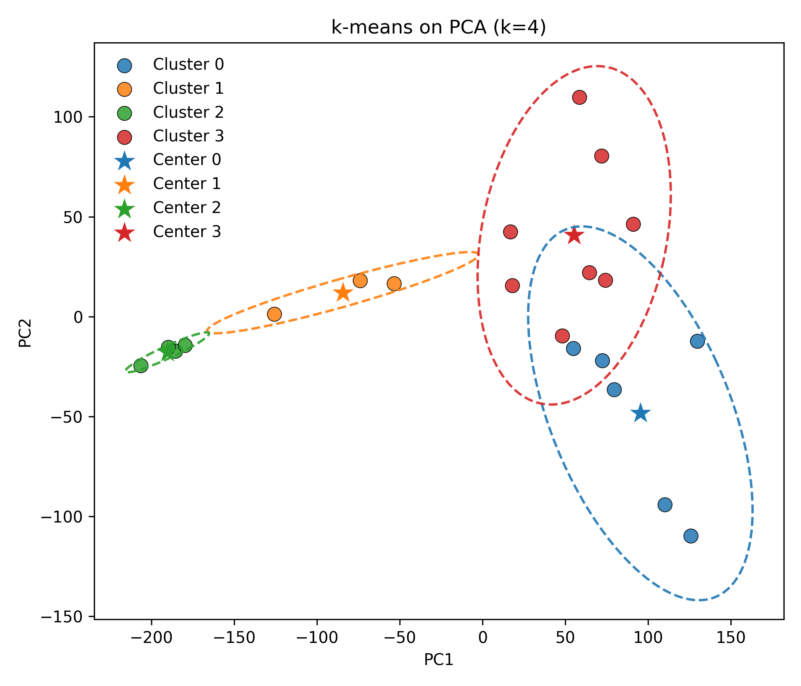
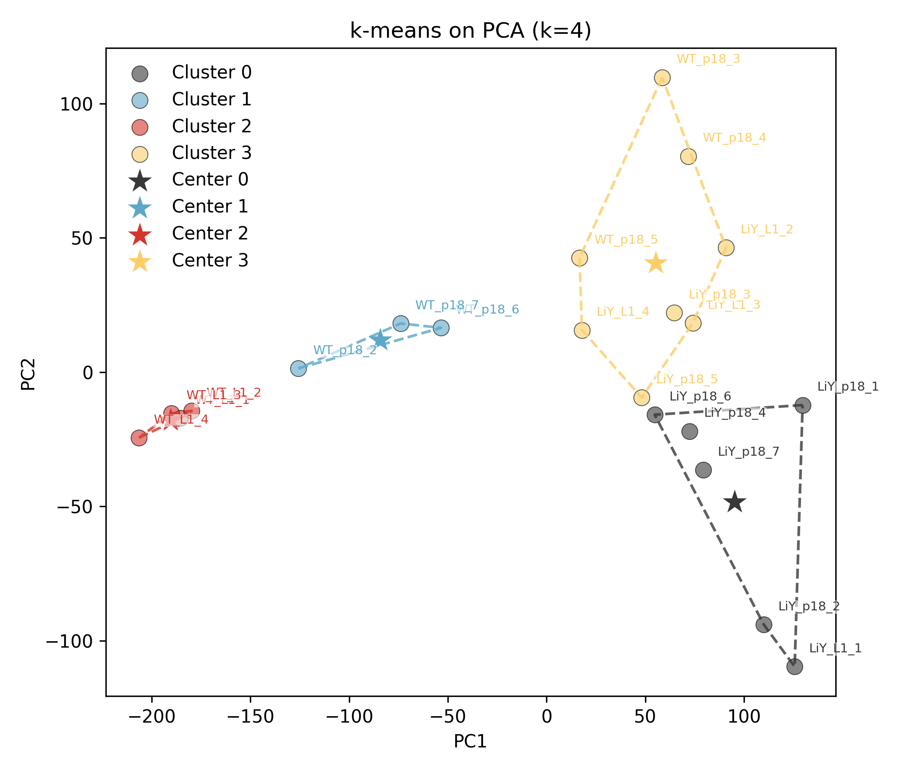

# MachineLearning

## 2026.1.15 pca
pca is a machine learning method to put the high level data like 3D reduce to 2D
remember to transpose before drawing the plot

  
  

---

## Kmeans and PCA
Kmeans is for cluster group

  
  
  

